# Change line

## V1

## V2

## Possible Markdown
### Sample 1
<pre>
private void Create_pending_csvs(string path = "")
{
  // Some code
}
</pre>

# ⇓
<pre>
  
private void Create_pending_csvs(string path <b><s>= ""</s></b>)
{
  <b> var newVariable = "applesauce";</b>
  // Some code
}

</pre>

## Sample 2

<pre id='snippet-step1'>
public void sendOutSeniorDiscounts(DataBase database, MailServer mailServer) {
     List&lt;Customer> seniorCustomers = <b>database.getSeniorCustomers()</b>;
     for (Customer customer : seniorCustomers) {
         Discount seniorDiscount = getSeniorDiscount();
         String message = generateDiscountMessage(customer, seniorDiscount);
         mailServer.sendMessage(customer, message);
     }
}
</pre>
<a
href='/approvaltests-util-tests/src/test/java/com/spun/util/persistence/LoadersAndSaversExamplesTest.java#L7-L16'
title='Snippet source file'>snippet source</a> | <a
href='#snippet-step1' title='Start of snippet'>anchor</a>
# ⇓
<!-- nippet: step2 -->
<pre id='snippet-step2'>
public void sendOutSeniorDiscounts(DataBase database, MailServer mailServer) {
     <b>Loader&lt;List&lt;Customer>> seniorCustomerLoader = () -> database.getSeniorCustomers();</b>
     List&lt;Customer> seniorCustomers =<s>database.getSeniorCustomers() </s> <b>seniorCustomerLoader.load()</b>;
     for (Customer customer : seniorCustomers) {
         Discount seniorDiscount = getSeniorDiscount();
         String message = generateDiscountMessage(customer, seniorDiscount);
         mailServer.sendMessage(customer, message);
     }
}
</pre>
## External Links

* [Martin Fowler](https://martinfowler.com/articles/class-too-large.html#:~:text=Modify%20the%20calling%20method)
* [java markdown creator](https://github.com/ScottBob/GenerateCodeCompare/blob/master/src/test/java/org/samples/SampleTests.java)
* [Markdown Preview](https://markdownlivepreview.com/)
